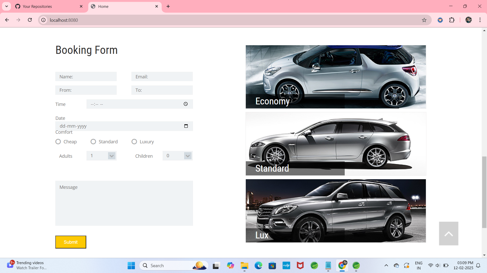
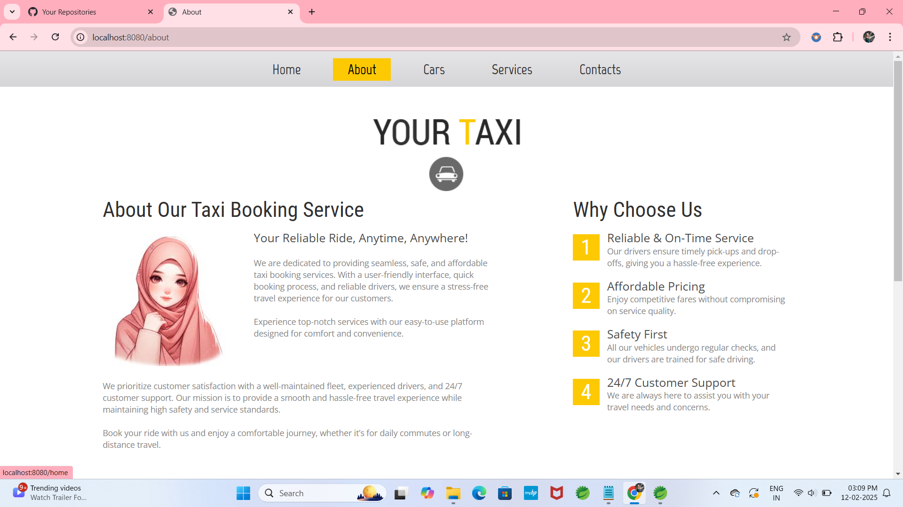
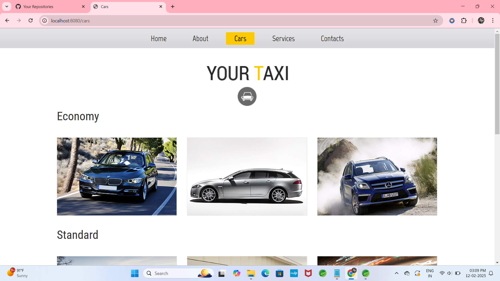
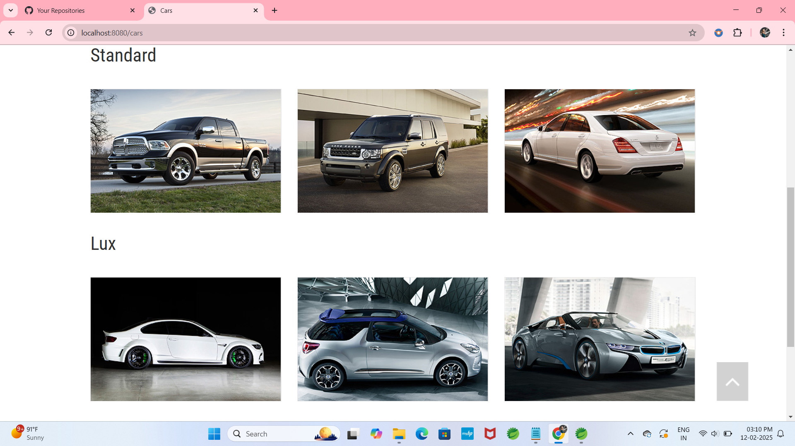
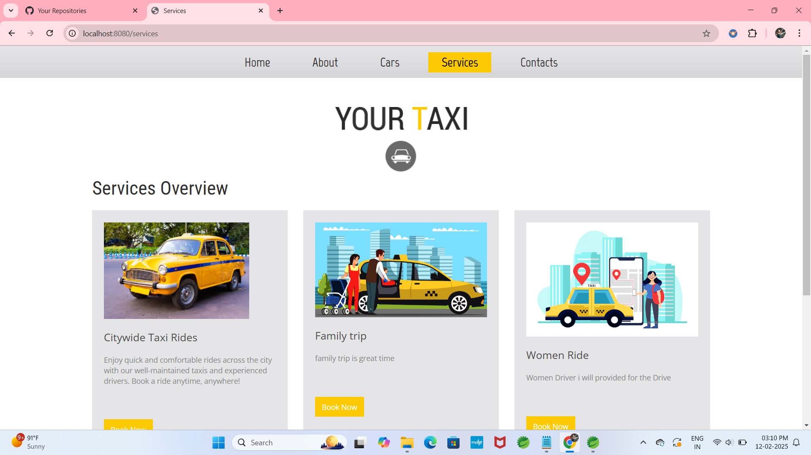
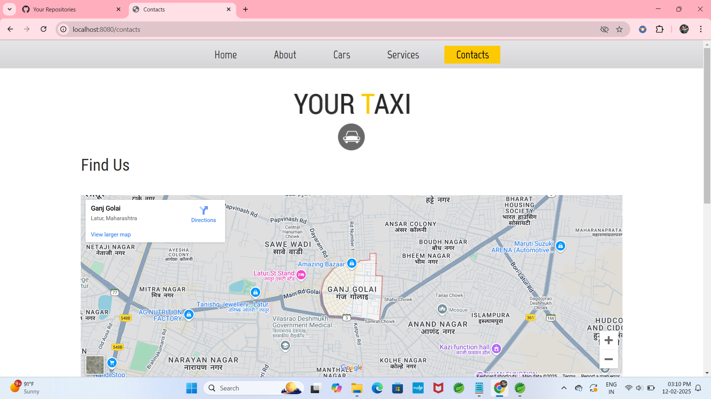
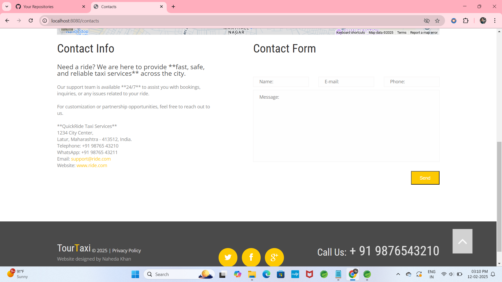

# TaxiBooking
Here is a well-structured **README.md** file for your **Taxi Booking System** project on GitHub. It includes a project description, features, technologies, setup instructions, and screenshots.  

---

### **📌 README.md for Taxi Booking System**  

```markdown
# 🚖 Taxi Booking System

The **Taxi Booking System** is a web-based application built using **Spring Boot, Hibernate, Thymeleaf, and MySQL**. This project enables users to **book taxis, manage bookings, and access an admin dashboard** for ride and user management. The system incorporates **Spring Security** for authentication and follows the **MVC architecture**.

---

## 📷 Project Screenshots  

### 🔹 User Panel  


|  |  |


|-------------|----------------------|
|  |  |


|-----------------|----------------|
|  |  |


|---------------|-------------|
|  |  |

---

## 🔥 Features  

✅ **User Authentication** – Secure login using **Spring Security**.  
✅ **Cab Booking** – Users can search for and book rides instantly.  
✅ **Admin Dashboard** – Manage users, bookings, and payments.  
✅ **Payment Integration** *(Future Scope)* – Secure online transactions.  
✅ **Email Notifications** *(Future Scope)* – Booking confirmations via email.  
✅ **GPS Tracking** *(Future Scope)* – Live ride tracking integration.  

---

## 🛠️ Tech Stack  

- **Backend:** Spring Boot 3.2.5, Hibernate, Spring Security  
- **Frontend:** Thymeleaf, HTML, CSS, JavaScript  
- **Database:** MySQL  
- **Server:** Apache Tomcat  
- **Tools & Dependencies:** Maven, Lombok  

---

## 🚀 Installation & Setup  

1️⃣ **Clone the Repository**  
```bash
git clone https://github.com/nahedpathan/TaxiBooking.git
```

2️⃣ **Navigate to the Project Directory**  
```bash
cd taxi-booking-system
```

3️⃣ **Configure Database (MySQL)**  
- Create a database named `taxi_booking_db`.  
- Update `application.properties` with your MySQL credentials.  

4️⃣ **Build and Run the Project**  
```bash
mvn spring-boot:run
```

5️⃣ **Access the Application**  
- **User Panel:** `http://localhost:8080/`  
- **Admin Panel:** `http://localhost:8080/admin/dashboard`  

---

## 👤 Role-Based Access  

🔹 **User Login** – Book rides, view ride history.  
🔹 **Admin Login** – Manage bookings, users, and ride details.  

| Role  | Username | Password |
|-------|---------|---------|
| Admin | `admin` | `admin123` |
| User  | `user1` | `password` |

---

## 🏗️ Future Enhancements  

🚀 **Mobile App Version** – Android & iOS integration.  
🚀 **Payment Gateway** – Secure online transactions.  
🚀 **AI-Based Ride Estimation** – Predict fare dynamically.  

---

## 📜 License  

This project is **open-source** under the **MIT License**. Feel free to contribute and improve it!  

---

## 🙌 Contributing  

💡 Want to improve this project? Fork it and create a pull request!  

---

🔗 **GitHub Repository:** [Taxi Booking System]

📩 **Contact:** If you have any queries, feel free to reach out!  

---

### 🎯 Developed by **Naheda Pathan** 🚀
```

---

